# I:CAN

## 📌 프로젝트 소개

**I CAN**은 사용자가 할 일을 보다 쉽고 효율적으로 관리할 수 있도록 도와주는 투두 관리 웹 애플리케이션입니다.

일정을 한눈에 확인하고, 할 일을 장바구니에 담아 간편하게 추가할 수 있으며,
다크모드 및 테마 설정을 통해 개인화된 사용자 경험을 제공합니다.

## 💻 프로젝트 기능

### 🧭 대시보드

서비스의 초기 화면으로, 한눈에 파악할 수 있도록 오늘의 할 일, 목표별 할 일 현황, 전체 진행률을 시각적으로 제공합니다.

- 오늘의 할 일 목록  
  오늘 날짜로 등록된 모든 할 일을 보여줍니다.
- 목표별 할 일 목록  
  사용자가 등록한 모든 목표를 탭으로 보여주며 각 목표에 해당하는 모든 할 일을 확인할 수 있습니다.
- 금일 진행도  
  오늘 완료한 할 일의 비율을 그래프로 시각화하여, 사용자가 하루 동안 얼마나 일정을 완성했는지 직관적으로 확인할 수 있습니다.  
  애니메이션을 통해 부드러운 화면을 제공합니다.
- 올해 달성률  
  1년간의 일별 완성률을 시각화한 잔디밭 형태의 그래프를 제공합니다.

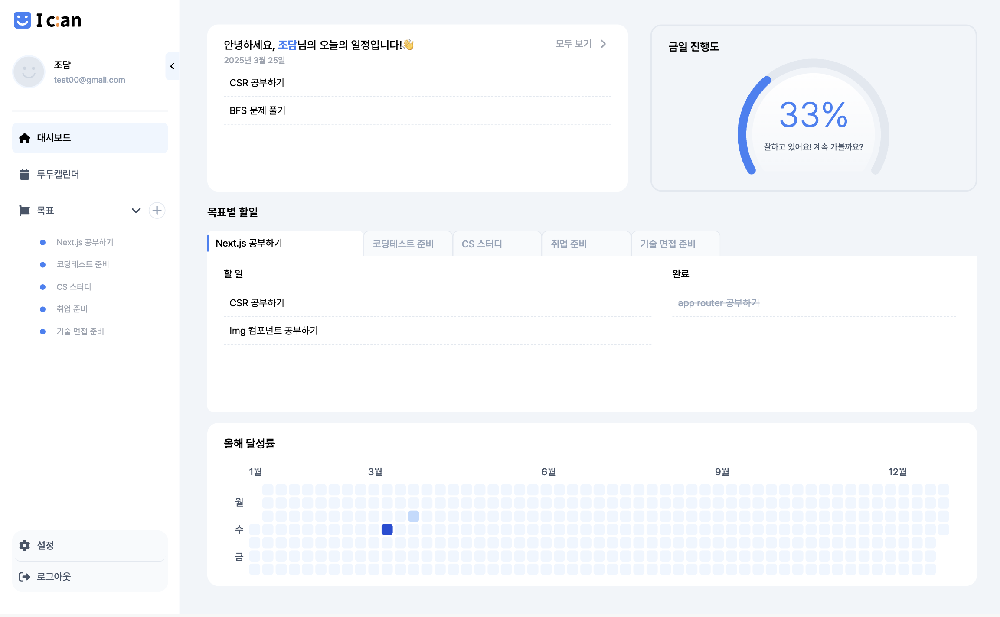

### 🗓️ 투두 캘린더

한눈에 월간 일정을 파악하고, 원하는 날짜에 할 일을 편리하게 추가 및 관리할 수 있는 달력 기반 일정 관리 페이지입니다.

- 월별 일정 확인  
  달력 형태로 이번 달에 등록된 모든 할 일을 시각적으로 보여주며,  
  각 날짜별로 할 일이 있는 경우 간단한 마크업으로 표시되어 일정을 빠르게 파악할 수 있습니다.  
  각 할 일은 목표의 색상에 맞게 나타납니다. 목표가 없는 경우 기본 테마색으로 제공됩니다.
- 일별 일정 확인  
  특정 날짜를 클릭하면 해당 날짜에 등록된 할 일 리스트가 우측 패널에 표시되어 확인하고 관리할 수 있습니다.
- 할 일 추가  
  선택한 날짜에 새로운 할 일을 추가할 수 있는 모달을 제공합니다.  
  할 일을 추가할 때는 날짜와 연동할 목표를 선택할 수 있어, 목표 기반 일정 관리가 가능합니다.
- 할 일 장바구니  
  날짜가 정해지지 않은 할 일들을 장바구니에 임시로 추가해 관리할 수 있습니다.  
  간단하게 할 일을 추가/삭제할 수 있어 가볍게 할 일을 쌓아둘 수 있습니다.
- 드래그 앤 드롭 기능  
  장바구니에 담긴 할 일을 캘린더의 특정 날짜로 드래그하면,  
  해당 날짜의 할 일로 자동 등록되며, 동시에 장바구니에서는 자동으로 제거됩니다.

|                     캘린더                      |               장바구니 드래그 앤 드롭                |
| :---------------------------------------------: | :--------------------------------------------------: |
| 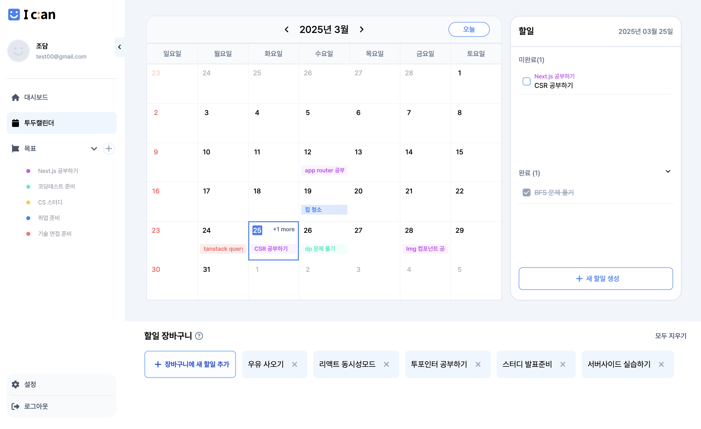 | 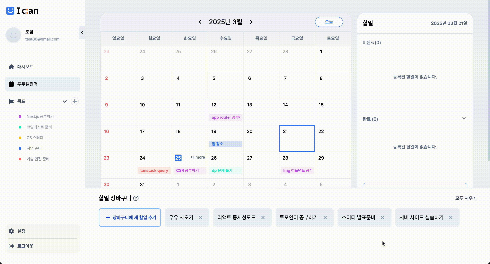 |

|                   할일 생성                   |                     날짜 선택                      |                     목표 선택                      |
| :-------------------------------------------: | :------------------------------------------------: | :------------------------------------------------: |
| 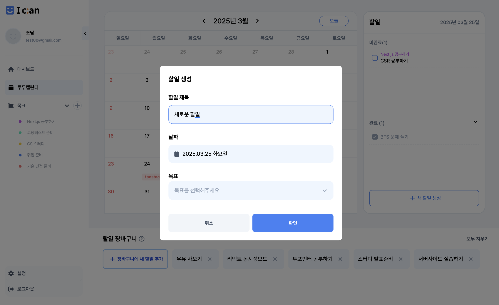 | 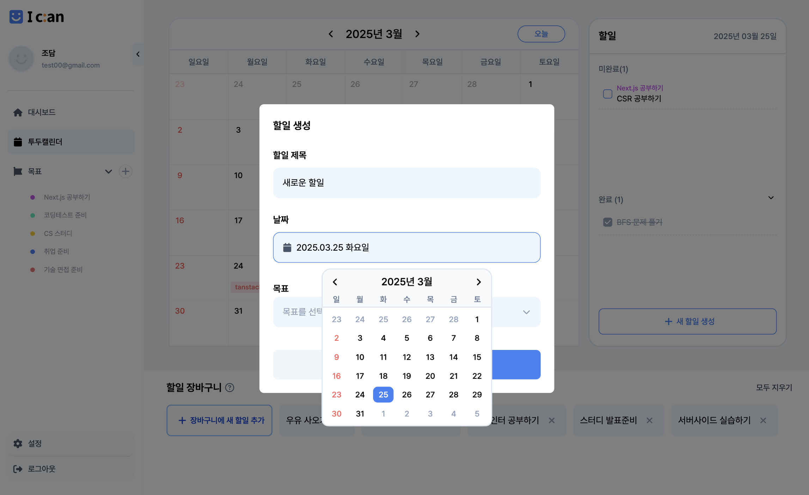 | 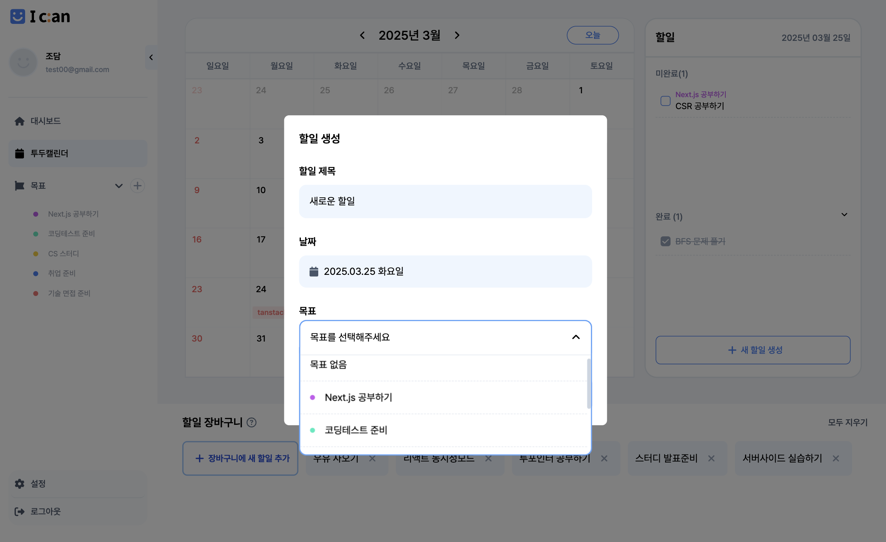 |

### 🎯 목표

목표별로 할 일을 관리하고, 해당 목표의 진행 상황과 노트를 한눈에 확인할 수 있는 페이지입니다.

- 목표 정보 수정  
  목표 제목과 색상을 변경할 수 있으며, 각 목표를 사용자의 스타일에 맞게 커스터마이징할 수 있습니다.
- 진행도 그래프  
  목표에 등록된 할 일 중 완료된 비율을 시각적인 그래프로 제공하여, 사용자가 해당 목표를 얼마나 달성하고 있는지 쉽게 파악할 수 있습니다.  
  애니메이션을 통해 부드러운 화면을 제공합니다.
- 할 일 목록  
  해당 목표에 등록된 할 일들을 오늘 / 지난 할 일 / 예정된 할 일로 구분해 보여줍니다.
- 목표별 할 일 장바구니  
  아직 날짜를 지정하지 않은 할 일을 임시로 추가할 수 있으며,  
  해당 장바구니의 할 일을 Date Picker를 통해 날짜를 지정하여 일정으로 옮길 수 있습니다.
- 할 일 생성 모달  
  해당 목표에서 새 할 일을 추가할 수 있으며, 이때 목표가 자동으로 선택된 상태로  
  날짜와 제목만 입력하면 바로 생성됩니다.
- 노트 모아보기  
  해당 목표의 할 일들에 작성된 노트들을 한 번에 모아볼 수 있습니다.  
  이 기능을 통해 목표 관련 모든 기록을 빠르게 확인하고 관리할 수 있습니다.

|               목표 조회                |                  목표 수정                  |                노트 모아보기                |
| :------------------------------------: | :-----------------------------------------: | :-----------------------------------------: |
| 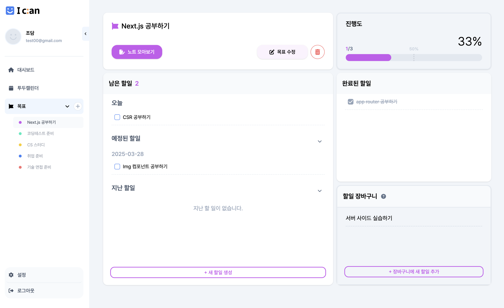 | 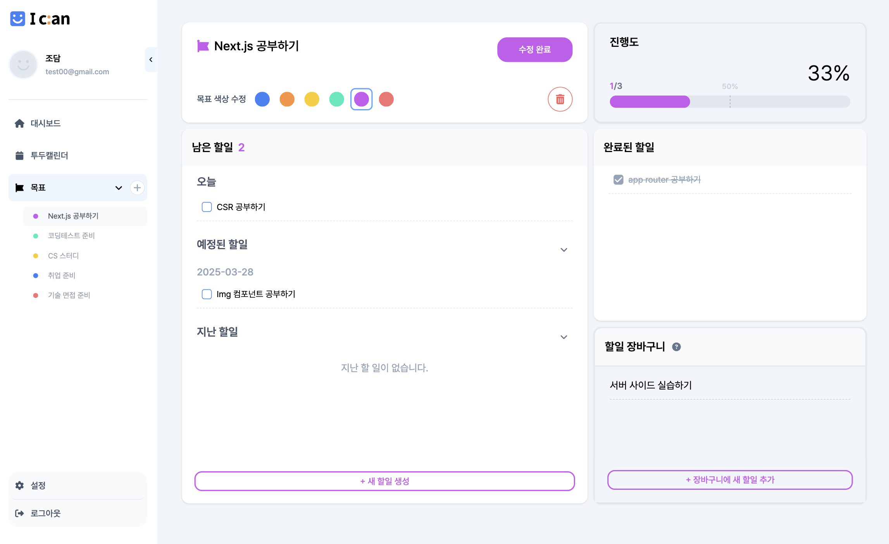 | 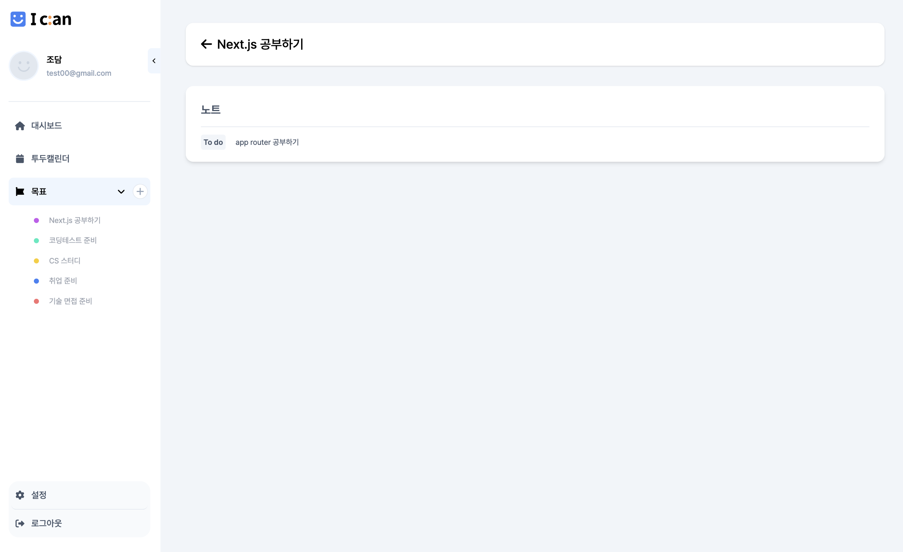 |

|                     할일 생성                      |                   장바구니 date picker                   |
| :------------------------------------------------: | :------------------------------------------------------: |
| 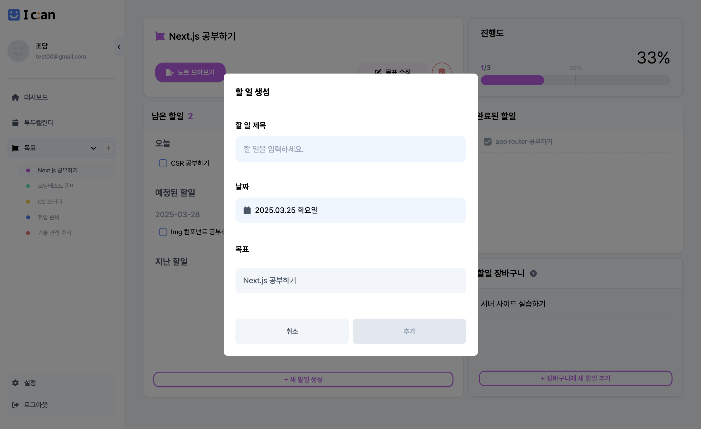 | 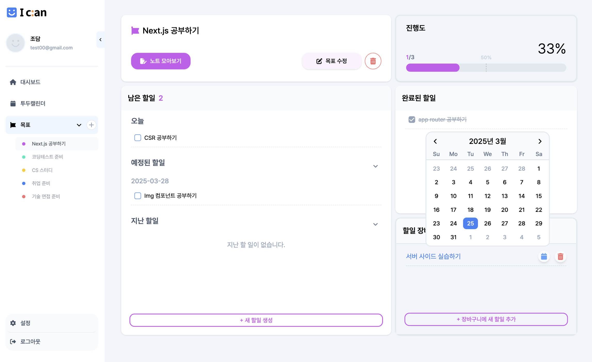 |

### 📝 노트

할 일에 대한 노트를 자유롭게 작성하고, 관련 링크를 함께 확인할 수 있습니다.

- 리치 텍스트 에디터 지원  
  `React Quill`을 사용하여 텍스트에 다양한 스타일(볼드, 이탤릭, 리스트, 구분선 등)을 적용할 수 있습니다.
- 링크 임베드 기능  
  노트에 링크를 추가하면, 해당 링크 페이지를 노트 좌측에 임베드 형태로 미리보기할 수 있습니다.  
  임베드 미리보기를 지원하지 않는 사이트의 경우, 이를 안내하고 외부 페이지로 이동할 수 있는 링크를 함께 제공합니다.
- 임시 저장  
  노트를 작성 중일 때 언제든 임시 저장할 수 있으며, 이후 해당 할 일에 다시 노트를 작성할 경우 저장된 내용을 불러와 이어서 작성할 수 있습니다.
- 모달 기반 노트 조회  
  노트는 모달창 형태로 간편하게 조회할 수 있어, 전체 페이지 이동 없이 빠르게 내용을 확인할 수 있습니다.  
  이 모달창에서도 임베드된 링크를 좌측에서 바로 확인할 수 있어, 기록과 자료를 동시에 열람할 수 있습니다.

|                   노트 생성                   |             임시저장한 요소가 있을 때              |
| :-------------------------------------------: | :------------------------------------------------: |
| 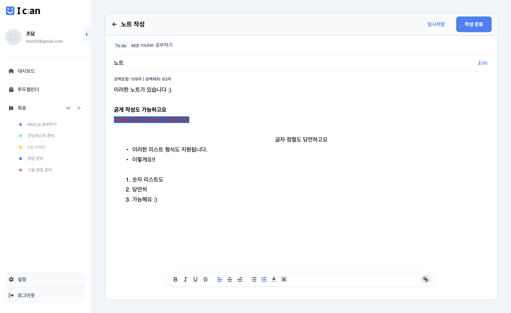 | 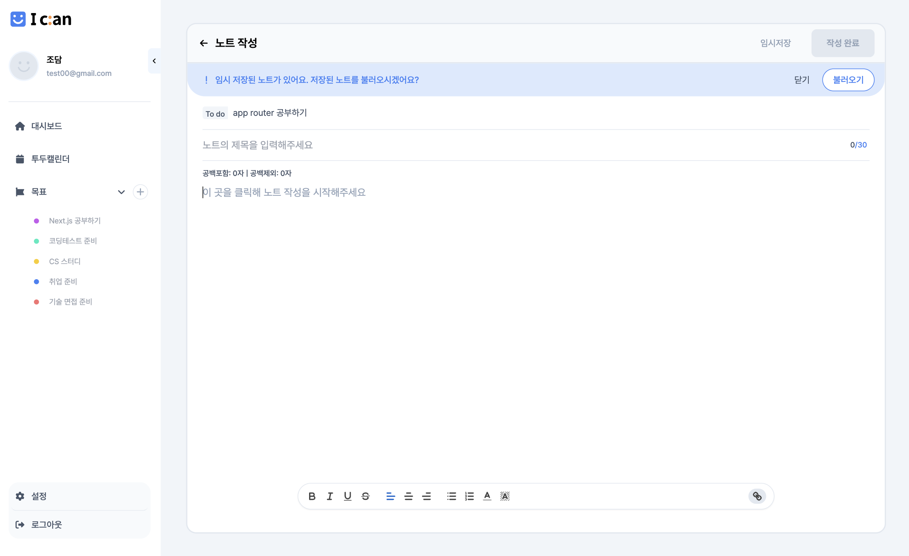 |

|                  링크 임베드 가능                   |                링크 임베드 제공 안될 시                |
| :-------------------------------------------------: | :----------------------------------------------------: |
| 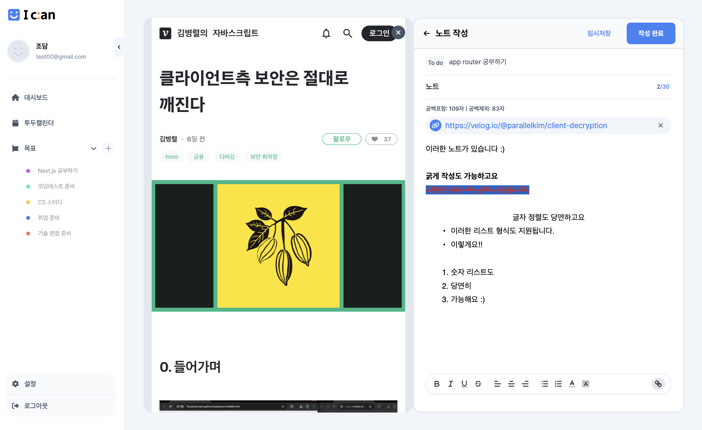 | 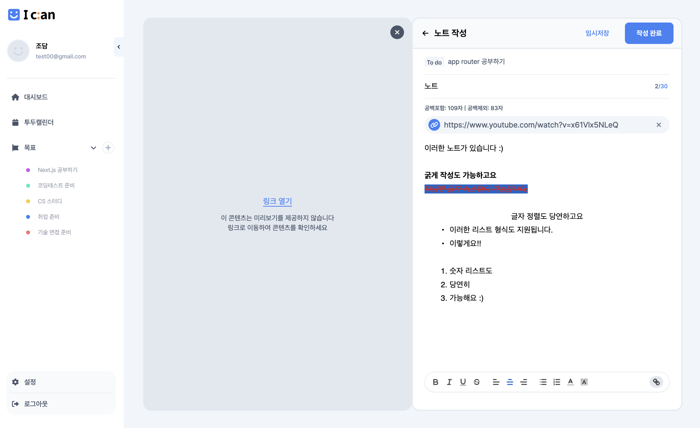 |

|               노트 조회 모달창               |              노트 모달창 링크 임베드               |
| :------------------------------------------: | :------------------------------------------------: |
| 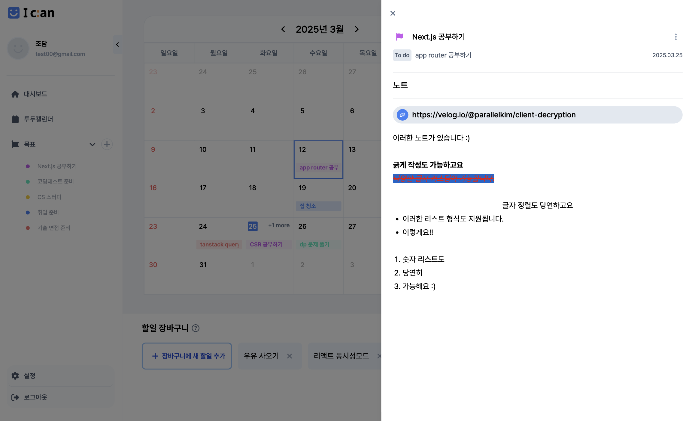 | 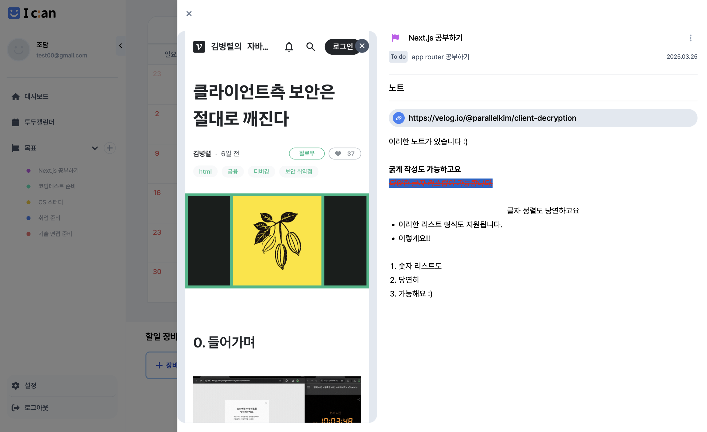 |

### ⚙️ 사용자 설정

사용자의 정보를 수정하고, 테마를 자유롭게 커스터마이징할 수 있는 개인화 설정 페이지입니다.

- 프로필 수정  
  프로필 사진과 닉네임을 변경할 수 있으며,  
  사용자 계정을 본인에게 맞게 꾸밀 수 있도록 지원합니다.

- 테마 설정  
  `라이트 모드`, `다크 모드`, 그리고 시스템 설정에 따라 자동 전환되는 `시스템 모드`를 제공합니다.  
  추가로 4가지 색상 테마 중 원하는 색을 선택할 수 있어,  
  사용자는 자신만의 스타일에 맞는 UI 테마를 구성할 수 있습니다.

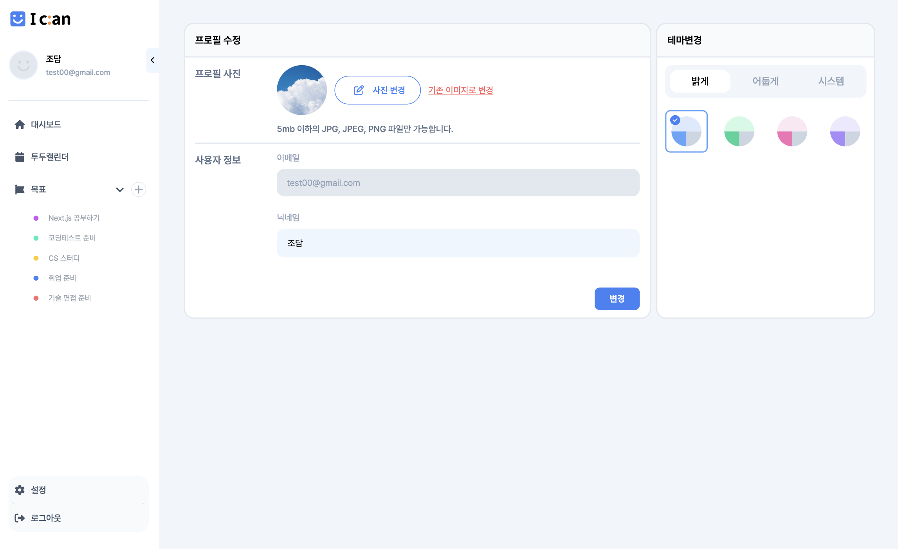

|                라이트모드 핑크 테마                |                라이트모드 초록 테마                 |                 다크모드 보라 테마                  |
| :------------------------------------------------: | :-------------------------------------------------: | :-------------------------------------------------: |
| 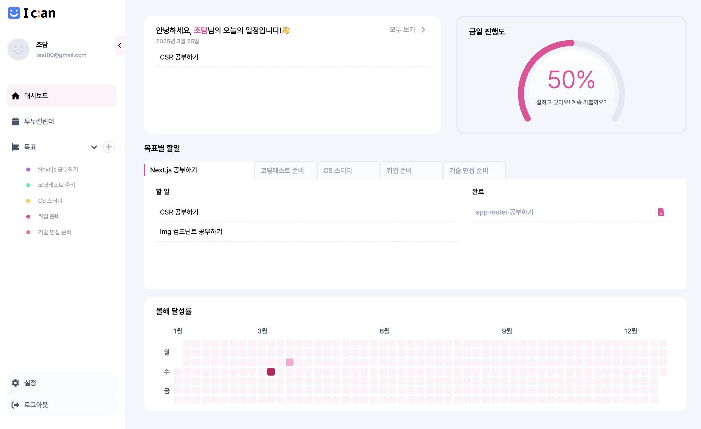 | 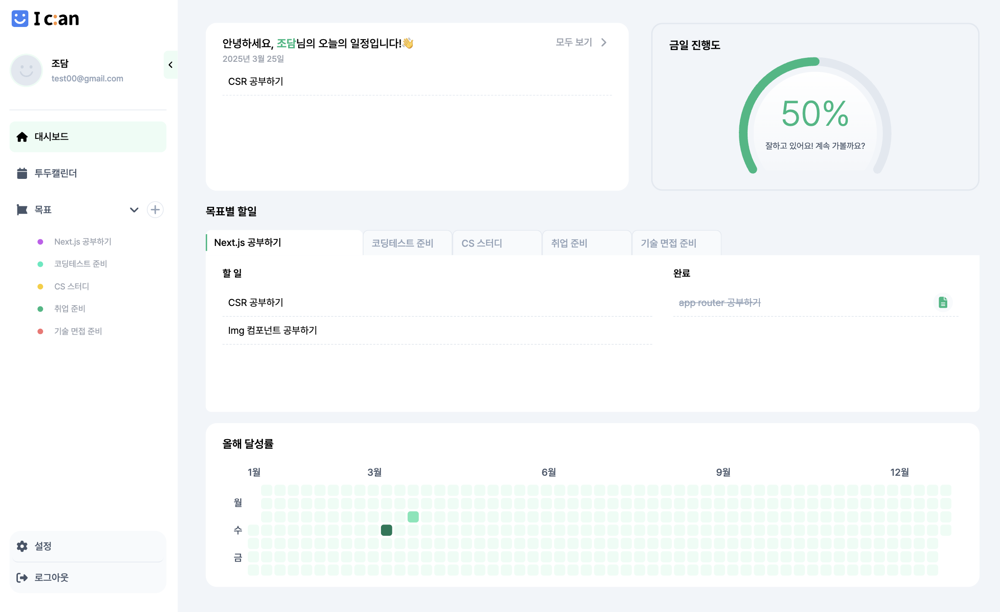 | 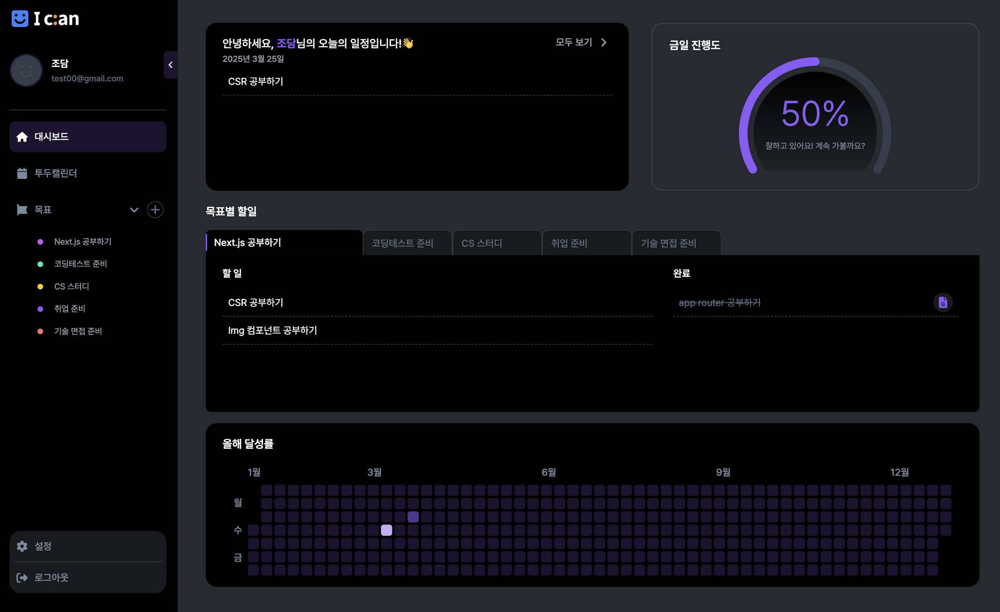 |

## ⚒️ 기술 스택

### 🖥️ Client

|                  |                                                                                                                                                                                                                                                                                                                                                         |
| :--------------- | :------------------------------------------------------------------------------------------------------------------------------------------------------------------------------------------------------------------------------------------------------------------------------------------------------------------------------------------------------ |
| Framework        |                                                                                                                                                                                                                                                 |
| Language         |                                                                                                                                                                                                                                          |
| Styling          |                                                                                                                                                                                                                                       |
| State Management |                                                                                                                                                                                                                                        |
| Version Control  |                                                                                                                                                 |
| IDE              |                                                                                                                                                                                                                    |
| Collaboration    |    |
